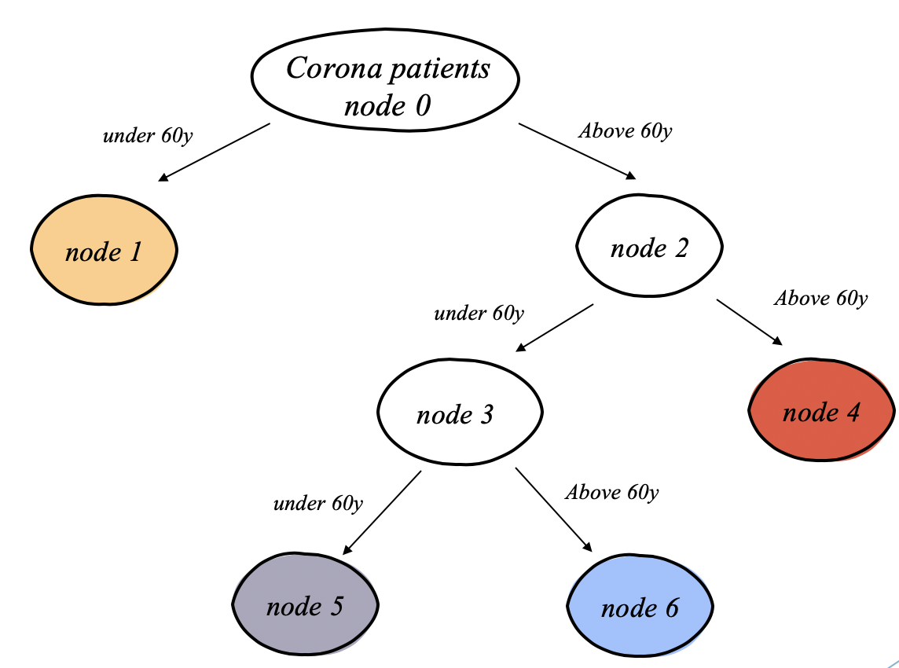

# Finding Sub-types of Diseases 

Some diseases may have sub-types that react differently to treatment. Therefore, finding a cure for such diseases requires identifying these subtypes. 
In this work we are taking a method that has been presented theoretically in previous work and implement it for the purpose of finding sub-types of diseases, using machine learning tools. The aim of the current study is to take advantage of the differences between separate populations, using an additional observed signal which is corelated with the unobserved target variable (sub-type), to better recover the underlying structure of a disease. 

## The Algorithm 

In General, the algorithm builds a clustering tree assuming that the clusters are disjoint. Each node in  the tree is a classifier trained to separate between two populations. At the beginning we take data of patients who having a known disease and create two samples from it, according to prior knowledge about the risk factors of the disease, reweight the patients such that the two samples will have the same cumulative weight, and train the classifier. The first classifier becomes the root of the tree and it splits to two sets, as the next step we take all of the patient in each set separately, reweigh them again and train another classifier to separate between the two samples. We keep going in the same fashion until all the patients associated with a leaf are from the same cluster in which case, no classifier can split the cluster any better than random.

## The Dataset - Coronavirus

With the outbreak of the Corona epidemic in Israel, the Ministry of Health began publishing a database that includes characteristics of people who undergo Corona tests. The dataset used for this project is available as CSV file called 'corona_dataset.xlsx'. In addition, pre-processing of the data before using the algorithm is necessary. More information and the various steps are available in the file 'Preprocessing_Corona.py'. 

## 'Classifier_Tree_Corona.py' 

This is the main code including all the functions necessary for creating the clustering tree. 

### 'build_tree' - The main function - 
This function uses the other functions written in the code to build the clustering tree.

##### Input - 
1. features - Pandas dataset with all the necessary features
2. ground_truth - The class of each record in the features dataset, shouls be with the same number of rows. This algorithm is suitable for binary classification, ie for 2 classes marked as [-1, 1]
3. alpha - The deviation we allow from 0.5 error
4. min_size_leaf - The minimum number of records per leaf

##### Output - 
1. left_list - Each index represent a node in the clustering tree, the value each index recieves represents the number of it's left child
2. right_list - Each index represent a node in the clustering tree, the value each index recieves represents the number of it's right child
3. model_list - Details of the classifier trained at each of the internal nodes, according to the index of the list in which the classifier appears
4. records_per_leaf - Dictionary in which the keys are the number of the leaf and the values are the original indexes from the database of the patients that belonged to this leaf

### 'get_class_weights' - 
Calculating the weight of each class in order to perform the reweigh in the classifier

### 'set_SVM_model' - 
For our model we use SVM. This function defines the classification according to which the clustering tree will be built, can be changed as needed

### 'get_split' - 
Split to two child nodes

### 'split' - 
Create child splits for a node or make terminal

## 'Classifier_Tree_Corona-FULL_EXAMPLE.py' 

This is a complete example of the creation of the clustering tree of the corona data set. This code includes pre-processing of the data as well as visual display after division into clusters after using t-SNE for dimension reduction. 

For Example - The tree format obtained at the end is:

  left_list = [1, -1, 3, 5, -1, -1, -1]
  
  right_list = [2, -1, 4, 6, -1, -1, -1]
  
  

